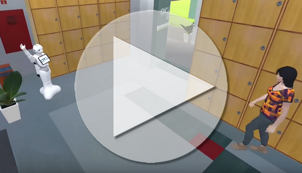
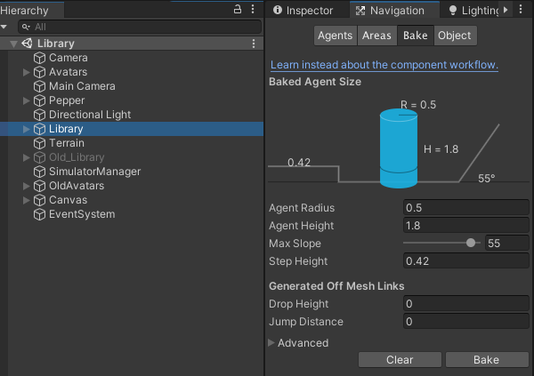

# simDRLSR: Deep Reinforcement Learning Simulator for Social Robotics

[![Contributors][contributors-shield]][contributors-url]
[![Forks][forks-shield]][forks-url]
[![Stargazers][stars-shield]][stars-url]
[![Issues][issues-shield]][issues-url]
[![GNU License][license-shield]][license-url]
[![Scholar][scholar-shield]][scholar-url]


<!-- PROJECT LOGO -->
<br />
<p align="center">
  <a href="https://github.com/JPedroRBelo/simDRLSR">
    
  </a>

  <!-- <h3 align="center">simDRLSR</h3> -->

  <p align="center">
    Simulator for Deep Reinforcement Learning and Social Robotics   
     <!-- <br /><a href="https://github.com/othneildrew/Best-README-Template"><strong>Explore the docs »</strong></a> -->
    <br />
    <br />
    <a href="https://youtu.be/e4C8hK4q8Ug" target="_blank">View Video</a>
    ·
    <a href="https://github.com/JPedroRBelo/simDRLSR/issues">Report Bug</a>
    ·
    <a href="https://github.com/JPedroRBelo/simDRLSR/issues">Request Feature</a>
  </p>
</p>


<!-- TABLE OF CONTENTS -->
<details open="open">
  <summary>Table of Contents</summary>
  <ol>
    <li>
      <a href="#about-the-project">About The Project</a>      
    </li>
    <li>
      <a href="#getting-started">Getting Started</a>
      <ul>
        <li><a href="#prerequisites">Prerequisites</a></li>
        <li><a href="#installation">Installation</a></li>
        <li><a href="#simdrlsr-configuration">SimDRLSR Configuration</a></li> 
        <li><a href="#mdqn-configuration">MDQN Configuration</a></li> 
        <ul>
          <li><a href="simmdqn">simMDQN</a></li>
           <li><a href="pymdqn">pyMDQN</a></li>
        </ul>
        <li><a href="#running-simulator-with-MDQN-pre-treined-model">Running simulator with MDQN pre-treined model</a></li> 
        <li><a href="#training-a-new-model">Training a new model</a></li> 
        <li><a href="#training-with-pymdqn-instead-of-simmdqn">Training with pyMDQN instead of simMDQN</a></li> 
      </ul>
    </li>
    <li><a href="#license">License</a></li>
    <li><a href="#references">References</a></li>
  </ol>
</details>

## About the Project

SimDRLSR is a simulator for social robotics that offers resources for training and validation of reinforcement and deep learning methods.

The objective is to provide an environment for the development of automatic learning techniques for human interactive behaviors and, from there, to react naturally and appropriately to these behaviors aiming at the application in social robots. The simulator aims to provide a tool to assist in the stages of development, testing, and configuration of parameters of learning systems for social robotics.

The first version of the simulator is based on the MDQN algorithm as a reinforcement learning module, available at:

https://github.com/ahq1993/Multimodal-Deep-Q-Network-for-Social-Human-Robot-Interaction

The simulation environment is an implementation derived from the Robot House Simulator (RHS) [[1]](#1) [2]](#2), into the Laboratory of Robot Learning (LAR) of the ICMC/USP ( Brazil). The architecture called Multimodal Deep-Q-Network (MDQN), proposed in [[3]](#3),  is used to validate the proposed environment.

### Robot Actions

The simDRLSR simulator offers the Pepper robot structure as an agent, which interacts with the environment using four actions:

 - **Wait**: wait, while looking at a random direction of the environment;
 - **Look**: looks at the nearest human, if he is in the robot's field of view;
 - **Wave**: makes the gesture of waving while looking at the nearest human;
 - **Handshake**: performs the handshake gesture to greet the human.

### States

The robot captures two types of images to model the state of the environment: grayscale images; and depth images. 
For each of these channels, 8 image sequences are captured. These images help the agent to model the state in the reinforcement learning paradigm.

### Reward


## MDQN 


The MDQN model aims to contribute so that social robots can correctly interpret human behaviors to act appropriately with them. In this model, two DQN networks are used for the characteristic automatic extraction to estimate the action-value function, one for grayscale images and another for depth images. The robot captures these images in a real environment in which it aims to interact with people.

MDQN has two phases of processing:

1. **Data Generation Phase**: the agent interacts with the environment using the Q-network, observing the current scene and acting on the environment using the greedy approach. The grayscale and depth images make up the agent's observations. After the execution of each action, the system returns a reward. In this way, the repetition memory stores the $N$ experiences of interactions.
2. **Training Phase**: uses the repetion memory for training.

The simDRLSR simulator assists in the data collection phase, replacing the real robot.


[](https://youtu.be/e4C8hK4q8Ug)


## Getting Started

### Prerequisites

Simulator requirements:
- 
- Unity Linux Build Support (IL2CPP)

MDQN requirements. It is recommended to install the following packages/frameworks using :
- Ubuntu  16.04  LTS  
- LUA  5.2  
- Torch7
- CUDA  10.1.

Alternatively, you can use pyMDQN, a Python 3 version of MDQN:
- Python 3.8 
- Pytorch (version 1.7.1 is recommended)
- (Optionally) Conda 3 

### Installation

1. Cloning repository
 
   Clone the repo without pyMDQN (MDQN with lua, only):
   ```sh
   git clone git@github.com:JPedroRBelo/simDRLSR.git simDRLSR
   ```
   Alternatively, you can clone the repo with python implementation (pyMDQN) of MDQN (also clone Lua version):
   
   ```sh
   git clone --recursive git@github.com:JPedroRBelo/simDRLSR.git simDRLSR
   ```
2. Building simDRLSR:

  - Open the simDRLSR Unity folder with Unity Editor
  - In Editor go to `File>Open Scene>`
    - Choose "Scenes/Library.unity"
  - Verify if NavMesh is configured:
    
    - Go to `Window>AI>Navigation`
    - Select "Libray" on Hierarchy
    - In `Navigation/Bake` tab, click on "Bake" button   
  
     
    
  - In Editor go to `File>Build Settings...`:
    - Scenes in Build, check:
      - [x] "Scenes/Libray"
      - [x] "Scenes/Empty"
    - Platform: PC, Mac & Linux Standalone
      - Target Platform: Linux
      - Architecture: x86_64 
    - Click Build button:
      - set executable name to simDRLSR.x86_64
      - save inside simDRLSR repo folder

    

     

### SimDRLSR Configuration

The `config.xml` file stores the settings for the simulation. The configuration options are:
- **Simulation Quality**:
  - Very Low
  - Low
  - Medium
  - High
  - Very High  
  The default value is "Medium".
- **Frames Per Second (FPS)**: 60
- **Screen Width**: 1024
- **Screen Height**: 768
- **Fullscreen**: True or False (default)
- ‼️ **IP Address**: stores the IP of MDQN module. Default is 172.17.0.3. If are running the MDQN on a docker container, you need to set the container's IP.If you are running MDQN on the same system as the simulator, localhost IP 127.0.0.1 will probably solve the problem).
- ⚠️ **Port**: port that the MDQN module uses for socket communication. Default is 12375.
- **Path Prob Folder**: folder with human avatar probabilities files.
- ⚠️ **Path WorkDir**: directory with MDQN files. Default is `simDRLSR/simMDQN/`. Change to `simDRLSR/pyMDQN`if you need to use pyMDQN.
- ⚠️ **Total Steps**: defines the number of interactions that robot performs at each data collection. Note: set a higher value than set in the MDQN.

Labels:
- ‼️ : fundamental importance, needs to be configured;
- ⚠️ : needs to be configured if the MDQN parameters are modified;

The IP Adress,most likely, will be the only value you should change.

### MDQN configuration

The simulator simDRLSR v0.1 is based on  published in the scientific article in [[3]](#3). We made minor changes to the original code and made it available in the folder called "simMDQN". 

#### simMDQN

To run simMDQN it's necessary set the host IP address:

  - Edit `robot_environment.lua`
  - Change the local variable `host` to the IP address were simDRLSR is running. If you are running in same system, enter the address localhost `127.0.0.1`. If you are using a docker container, you need to check the IP of the host SO.

(Optional) If you prefer to use CPU instead of GPU, you need to configure the following files:

  - Edit `train_ql.lua`and set `local gpu = 0` to use CPU, or `local gpu = 1` to use GPU;
  - Edit `TrainNQL.lua`and set `self.gpu = 0` to use CPU, or 1 to use GPU.

⚠️ The minimum VRAM is approximately 6GiB.

‼️ This code uses unsupported frameworks and libraries for newer systems. Therefore, it is recommended to use a docker container to run simMDQN.

‼️ Even using Docker, you will have to make several configurations in the system and ensure that the container has access to the simMDQN directory, in addition to configuring write and read permissions.

As the configuration of MDQN with lua has some problems we are developing a version in Python 3. This version is a submodule available in this repository available in pyMDQN.

#### (Optional) pyMDQN

The pyMDQN folder available in this repository belongs to the  branch, adhering to the parameters used in version 0.1 of simDRLSR.

To configure pyMDQN:

- If you cloned the simDRLSR without pyMDQN (MDQN with lua, only), you need to clone pyMDQN manualy:

```sh
cd simDRLSR
git clone git@github.com:JPedroRBelo/pyMDQN.git pyMDQN
cd pyMDQN
git checkout simDRLSRv01
```
- ⚠️ To use pyMDQN it is not necessary to use a docker container, however, we encourage the use of Conda to install modules, such as pytorch, pip, numpy, etc.
- The IP address is seted to localhost IP `127.0.0.1`. You can change this in `environment.py` pyMDQN script.

### Running simulator with MDQN pre-treined model

At v0.1 of simDRLS, we treined the simMDQN over 28000 interactions (14 eps., 2000 steps each ep.). To test the simulator with pretreined MDQM, folow this steps: 

1. To run the simulator, you need to execute:

  ```sh
  cd simDRLSR
  ./simDRLSR.x86_64
  ```
2. To run simMDQN:
  - Open a new terminal, or enter on a docker container
  - Execute:
  ```sh
  cd simDRLSR/simMDQN
  th validate.lua
  ```
The simulator is a socket server, and MDQN is a client. Thus, it is necessary to run the simulator first.
The robot will execut 2000 steps, trying to interact with human throught the four legal actions _wait_, _look_, _wave_ and _handshake_.

At this point, we validate the simDRLSR only with simMDQN.Therefore, we do not provide a model for pyMDQN.

### Training a new model

1. Run the simulator, as described above: 

  ```sh
  cd simDRLSR
  ./simDRLSR.x86_64
  ```
2. On a new terminal, or docker container:
 
 ⚠️ Make sure to back up your trained models before performing the next actions..
 
 - Erasing old train files and images: 
 
   ```sh
   cd simDRLSR/simMDQN
   rm -rf dataset/RGB/ep*
   rm -rf dataset/Depth/ep*
   ``` 
 
 - Initializing files and models:
 
   ```sh
   th makefiles.lua
   th init_model.lua
   ```
 
 - Run the main script:
   ```sh
   th main_train.lua
   ```
  
 The `main_train.lua` script will call the `datageneration_ql.lua` followed by `train_ql.lua` over N eps (N = 14 in original configuration).
 This is all you need to do to run the simulator together with MDQN!
 
 ### Training with pyMDQN instead of simMDQN
 
 1. Run the simulator, as described above: 

  ```sh
  cd simDRLSR
  ./simDRLSR.x86_64
  ```
2. On a new terminal:
 
  ⚠️ Make sure to back up your trained models before performing the next steps.
  
  ⚠️ Remmember to config. WorkDir of simDRLSR with pyMDQN directory!
 
 - Erasing old train files and images: 
 
   ```sh
   cd simDRLSR/pyMDQN
   rm -rf dataset/RGB/ep*
   rm -rf dataset/Depth/ep*
   ``` 
 - If you are using Conda environment:
 
   ```sh
   conda activate pytorch_env
   ```
 - Initializing files and models:
 
     ```sh
     python3 makefiles.py
     python3 init_model.py
     ```
 
 - Run the main script:
     ```sh
     python mdqn.py
     ```
## License

Distributed under the MGNU GPL 3.0. See `LICENSE` for more information.
 
 
## References
<a id="1">[1]</a> 
BELO, José Pedro R.; ROMERO, Roseli AF; AZEVEDO, Helio. 
"Rhs simulator for robotic cognitive systems". 
2017 Latin American Robotics Symposium (LARS) and 2017 Brazilian Symposium on Robotics (SBR). 
IEEE, p. 1-6, Curtiba, Brazil 2017.

<a id="2">[2]</a> 
BELO, José Pedro R.; ROMERO, Roseli AF; AZEVEDO, Helio. 
"Enhancements in a Social Robotic Simulator for Indoor Environments." 
2018 Latin American Robotic Symposium, 2018 Brazilian Symposium on Robotics (SBR). 
IEEE, João Pessoa, Brazil 2019.

<a id="3">[3]</a> 
Ahmed Hussain Qureshi, Yutaka Nakamura, Yuichiro Yoshikawa and Hiroshi Ishiguro 
"Robot gains social intelligence through Multimodal Deep Reinforcement Learning" 
Proceedings of IEEE-RAS International Conference on Humanoid Robots (Humanoids) 
pp. 745-751, Cancun, Mexico 2016.


  
  


<!-- MARKDOWN LINKS & IMAGES -->
<!-- https://www.markdownguide.org/basic-syntax/#reference-style-links -->
[contributors-shield]: https://img.shields.io/github/contributors/JPedroRBelo/simDRLSR.svg?style=for-the-badge
[contributors-url]: https://github.com/JPedroRBelo/simDRLSR/graphs/contributors
[forks-shield]: https://img.shields.io/github/forks/JPedroRBelo/simDRLSR.svg?style=for-the-badge
[forks-url]: https://github.com/JPedroRBelo/simDRLSR/network/members
[stars-shield]: https://img.shields.io/github/stars/JPedroRBelo/simDRLSR.svg?style=for-the-badge
[stars-url]: https://github.com/JPedroRBelo/simDRLSR/stargazers
[issues-shield]: https://img.shields.io/github/issues/JPedroRBelo/simDRLSR.svg?style=for-the-badge
[issues-url]: https://github.com/JPedroRBelo/simDRLSR/issues
[license-shield]: https://img.shields.io/badge/license-GNU%20GPU%203.0-brightgreen?style=for-the-badge
[license-url]: https://github.com/JPedroRBelo/simDRLSR/blob/development/LICENSE
[scholar-shield]: https://img.shields.io/badge/-Google%20Scholar-black.svg?style=for-the-badge&logo=google-scholar&colorB=555
[scholar-url]: https://scholar.google.com.br/citations?user=0nh0sDMAAAAJ&hl

